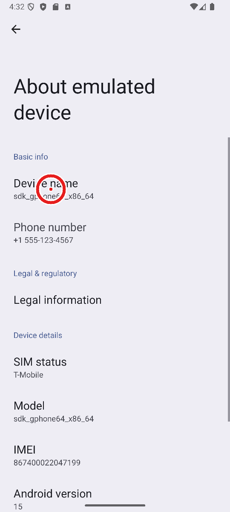

# 06 — A tap by position, asked every time

[Note 05](05-a-picture-where-the-list-has-nothing.md) gave the model a
picture of a screen the list can't read, and stopped there: the
picture was for reading. Settings' *About phone* page shows "Device
name" in it, and there was no number to tap it by. Renaming the phone
stayed out of reach, and in one run `gemma4:26b` renamed the Bluetooth
name instead and said it was done.

## Only where the list has nothing

`tap_at` taps a spot on the picture. It is refused anywhere the list
has something ("tap by number, not by position"), so note 01's bargain
holds everywhere it already held. It is refused where no picture may
be shown (an app on the `never` list), and in an app whose rules
refuse words: Setu keeps an X app read-only by refusing "post", "like"
and the rest, and a spot has no words to check against them.

**A SHARE OF THE PICTURE, NOT ITS PIXELS.** `x` and `y` run from 0 to
1000 across and down the picture. A model is often shown a picture
smaller than it was taken (a 1080×2400 screenshot arrives smaller at a
cloud model, and Ollama resizes too); a spot in pixels would then be
in the wrong place by the scale, and nothing would say so. A share is
the same spot at any size. On an Android phone it becomes pixels of
the screenshot; on an iPhone, points (`touch_size`), because a
screenshot there has two or three pixels to a point.

## Held every time, the spot ringed

**NO RULE CAN TELL WHAT IS AT A SPOT.** A tap on a numbered thing is
held when its words say it acts (Send, Pay, Delete). A spot has no
words: it might be "Device name", or "Erase all data" beside it. So
every tap by position is held, and `describe_hold` returns the
screenshot with the spot ringed in red, as an image beside its words,
for the harness to show the person. The person answers by looking.



Sparsh has no dependencies, so `picture.py` reads and writes PNG
itself (8 bits a channel, the five filters, not interlaced) and makes
the picture at most 720 pixels across. Marking a full emulator
screenshot takes about 1.6 seconds, once per hold.

**TYPING ON SUCH A SCREEN IS HELD TOO.** The rename dialog sits over
the About page, and the page behind it still never goes still, so the
dialog can't be read either. Typing without `into` goes where the
keyboard is, and Sparsh finds out where that is by reading the screen.
Here it can't, so it can't tell whether the field is a password. The
typing is held, and the person is shown the picture and the words.

**THE SCREEN MUST STILL BE THE PICTURE.** A yes given by looking holds
for the screen that was looked at. Before a held tap or typing on such
a screen is done, Sparsh checks the same app is in front and takes a
new screenshot: if more than 2% of it differs from the one the person
saw, nothing is done. A clock ticking is a few pixels; a page scrolled,
or a dialog opened or closed, is far more. The first version checked
"the list is still empty" instead, which costs a reading of the screen
(next paragraph) and misses a page that scrolled.

## What the emulator taught

**A SCREEN THAT NEVER GOES STILL COSTS TWELVE SECONDS A TRY.** With the
rename dialog open, each `uiautomator dump` waits about twelve seconds
before giving up, and Sparsh tried twice. A confirm read the screen
before the tap and after it: about fifty seconds, past Yantra's
thirty-second limit on a tool call. The tap was done, but the model was
told "timed out", and a model told that may tap again. Now a screen
whose app last couldn't be described is tried once, and the check
before the tap is a picture, not a reading. The same confirm takes
about fifteen seconds.

**A YES COMES BACK WITH THE PICTURE.** `confirm` answered in words
only, so after the first yes the model worked blind: in one run
`qwen3.8:latest` typed the name and then guessed where OK would be,
and the ring on the card sat in empty space below the dialog. The
trial's scripted yes said yes anyway, and the model said the phone was
renamed. It wasn't. A person shown that card would have said no, which
is what the card is for. `confirm` now returns the screen it led to,
like every other act, and the picture rides with it.

**FOUR YESES, NOT ONE.** Tap "Device name", type the name, tap OK, and
tap OK again on Android's warning that the name can be seen by others.
Enter in that dialog moves to Cancel rather than pressing OK. Each is
a spot or words nothing could check, so each asks.

## Live, on the emulator

Yantra's phone trial (`examples/phone_trial.py --shots --only
rename_phone --repeat 3 --cards DIR`), `qwen3.8:latest` on Ollama: "Rename
my phone to Trial Phone", graded by reading the phone's name over adb
afterwards. The trial says yes to every held step without looking, so
`--cards` keeps each card's picture to be looked at after:

```
qwen3.8:latest (ollama) -- 1 tasks x 3
  done                         3/3 (44-100%)
  a page that never goes still 16
  screenshots shown            16
  taps by position (held)      10
  went round the phone         0
  errors                       0

  per task:
  rename_phone     done     8 acts · 4 held, 4 confirm  (257.5s)
  rename_phone     done     9 acts · 5 held, 5 confirm  (327.9s)
  rename_phone     done     8 acts · 4 held, 4 confirm  (277.6s)
```

All thirteen cards ring what the model meant: "Device name", OK in the
dialog, OK on the warning (and once, the text field, one yes more than
needed). Each run went to the About page through Settings' own list,
and from there worked from the picture. Before the two fixes above, one
run took 695 seconds with three confirms timed out, and one ended with
a ring below the dialog and the phone not renamed.

## What the tests hold

`tests/test_mcp.py`: a tap by position is held, shown ringed, and done
on a yes at the same share of the screen; refused where the list has
something, in an app whose words are refused, and off the picture; not
done when the app changed or the screen no longer matches its picture,
done when only a clock ticked; typing on such a screen is held with
its picture; a yes comes back with the picture. `tests/test_picture.py`:
the ring, the smaller picture, every PNG filter read back, the
comparison, and None for what can't be read. `tests/test_phone.py`: a
screen that never goes still is tried once the next time. 144 tests
before, 159 after.

## Not here yet

* An iPhone. `touch_size` is there and untried, like the rest of the
  iPhone road ([note 03](03-an-iphone-through-a-mac.md)).
* ~~A real Android phone, with its own sizes and its own dialogs.~~ The
  Nexus 6P ([note 08](08-a-real-phone.md)); its list leaves the
  navigation bar out of the screen's size, which put a ring low until
  it was worked out from the picture ([note 10](10-where-the-list-falls-short.md)).
* ~~Showing the ring in a chat (Dvara's Telegram road).~~ Dvara sends
  the picture first and the buttons under it.
* ~~A tap by position only on a screen with no list.~~ Any screen that
  came with a picture, partly blank or asked for
  ([note 10](10-where-the-list-falls-short.md)).
